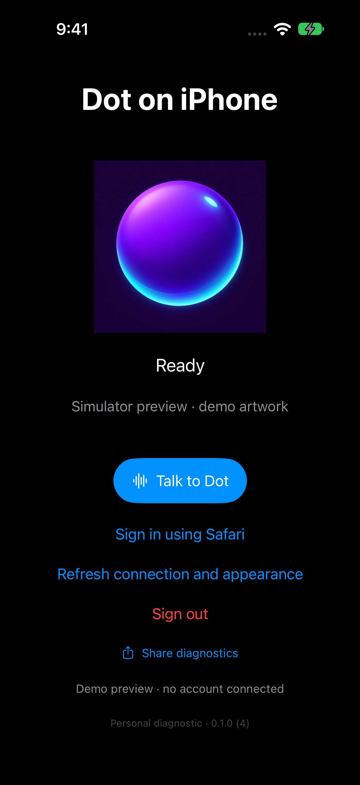
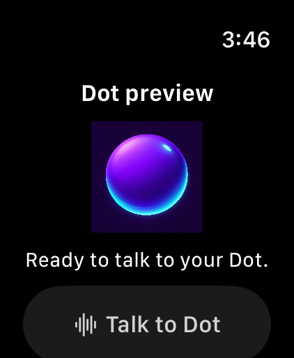
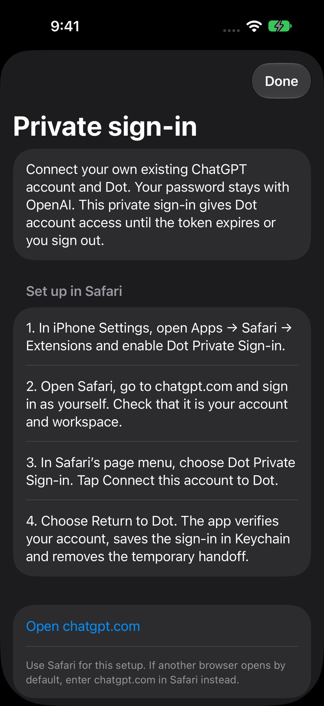
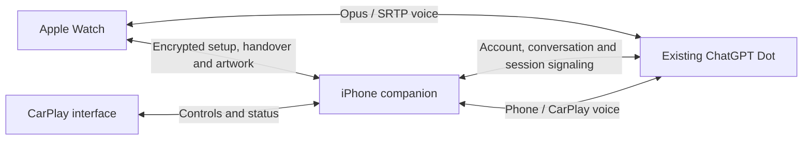

# Dot Watch

Native iPhone, Apple Watch and CarPlay interfaces to your existing ChatGPT Dot: the same account, conversation and character. Built with Swift, SwiftUI and native audio, with iPhone-assisted Watch setup and Watch-owned voice sessions.

**Experimental personal prototype — status as of October 4, 2026.** Short physical Watch conversations worked in build **0.1.0 (3)**, with substantially clearer playback, but locked-phone control could disconnect. Build **0.1.0 (4)** moved authentication and session ownership onto the Watch; two physical trials then lost transport at about 38 seconds, including one with the screen awake. Build **0.1.0 (5)** corrects reciprocal ICE addressing, adds authenticated consent refresh and plays a local ringback tone during setup. It passes automated tests, but sustained physical voice remains unverified. CarPlay has a dedicated interface and passing framework tests; it cannot yet be installed for vehicle use without Apple's entitlement approval. Official ChatGPT login for existing-Dot access is not integrated.

## Screenshots

These are unedited screenshots captured from the actual iPhone and Watch simulator apps. A simulator-only mode supplies the project's purple/cyan demo artwork and disables interaction, account access and voice. They show the native interface, not a logged-in account or a successful call. Real-device builds use the account's authentic cached Dot artwork.

| iPhone interface | Apple Watch interface |
|---|---|
|  |  |

The private iPhone setup instructions are also a native screen:



[Capture procedure and provenance](docs/SCREENSHOTS.md). No CarPlay head-unit screenshot is included: its actual dashboard rendering has not been validated.

## Where we are now

| Area | Verified status | Still open |
|---|---|---|
| iPhone setup | Signed personal build installed; device-only Keychain restores sign-in and the authentic character. User reports native phone voice works. | Broader microphone, interruption, audio routing and lifecycle acceptance. |
| Watch character | Authentic character synced and displayed on the physical Watch; native complication implemented. | Physical complication placement and customization refresh acceptance. |
| Watch voice | Physical dialogue and clearer playback verified on build 3. Build 4 implements Watch-owned discovery/start/stop and encrypted credential sync; no phone heartbeat is required. | Build 4 secure enrollment, locked/absent-phone operation, sustained/wrist-down reliability, uplink timing and battery measurements. |
| Safari bearer-token setup | Private Safari extension implemented and signed; eight mocked browser tests pass. | End-to-end Safari enrollment/renewal and an independent second account remain unverified. |
| Official OpenAI sign-in | PKCE/system-authentication foundation and eight sign-in tests. | Registered client and an approved grant for the existing Dot's voice/context/artwork. |
| CarPlay | Dedicated `CPVoiceControlTemplate` scene with character, Talk, Mute/Unmute and End; eight native-framework/lifecycle tests pass. | Apple entitlement, accepted root template, actual display, vehicle microphone/speakers and locked-phone tests. |
| Two-person setup | Account-scoped credentials, pairing and caches; ordering/revocation tests. | Each person's independent physical setup; no second-user acceptance yet. |

The detailed [acceptance record](docs/ACCEPTANCE.md) distinguishes implementation, simulator results, user reports and physical evidence. Publishing this repository does not mean TestFlight or App Store distribution is ready.

## Login: the current limitation and private workaround

**This project cannot currently use official “Continue with ChatGPT” sign-in to access your existing Dot.** The OAuth foundation is present, but client registration and a separate Dot access grant are outstanding. OpenAI's documented identity scopes and ChatGPT-plan Responses API scopes do not grant access to existing ChatGPT conversations. An API key or an identity token is not a replacement for this Dot connection. [Official scope documentation](https://developers.openai.com/siwc/quickstart).

The private build instead supports a **Safari bearer-token handoff**:

1. Install a personally signed `DotPrivate` build and enable **Dot Private Sign-in** in iPhone Settings → Apps → Safari → Extensions.
2. Sign in to your own account at `https://chatgpt.com` in Safari. OpenAI handles the password/login; Dot does not collect it.
3. Open the extension from Safari's page menu and select **Connect this account to Dot**.
4. The helper reads that account's current browser session, sends only its access token and account identifier to the native extension, and verifies actual Dot access before staging the handoff.
5. Return to Dot. The app validates the account, stores the bearer in `AfterFirstUnlockThisDeviceOnly` Keychain and deletes the temporary handoff.
6. Open Dot on the paired Watch and tap **Sync Watch sign-in**. The paired iPhone sends an encrypted, account-bound setup reply; the Watch saves its own device-only Keychain credential. After this initial sync, **Talk to Dot** starts directly from the Watch. The phone can stay locked; an independent Watch Wi-Fi/cellular connection is needed when the phone is unavailable.

This is an **undocumented private-development route**, not an approved OAuth integration. The token grants account access until expiry/revocation. No refresh token is copied and automatic renewal is not implemented: repeat the Safari steps and **Sync Watch sign-in** when renewal is required. Sign out before changing accounts; each person must use their own account and Dot. Never paste a token into an issue, a command line, a URL or this repository.

The helper's source and mocked tests are implemented; live Safari-to-app enrollment is still an acceptance gate. The currently verified personal setup also used an explicitly approved one-time local transfer. Beta/Release configurations exclude the private importer, Safari extension and private Watch voice UI. [Browser setup details](docs/PRIVATE-BROWSER-SETUP.md), [authentication boundaries](docs/AUTHENTICATION.md), [public release gates](docs/BETA-PUBLICATION.md).

## Known reliability limits

- **Watch connection loss:** build 3 lost its phone control lease. Build 4 removed that dependency, but two Watch-owned trials lost transport at about 38 seconds, with local audio released. Inspection found missing periodic ICE consent refresh and an omitted peer address needed to answer reciprocal checks. Build 5 corrects both and adds content-free transport diagnostics. This is a testable explanation, not confirmed service-side proof of the failure. Ten-minute locked-phone, absent-phone and wrist-down acceptance remains open. [Failure evidence and retest](docs/WATCH-CONNECTION-TIMEOUT.md).
- **Device handover:** syncing sign-in durably delegates voice permission to the Watch, even while it is idle. Starting on iPhone/CarPlay requires the Watch app to be reachable and positively acknowledge audio/server release plus credential revocation. If it is unavailable, the phone stays blocked. Sync again to return voice to the Watch.
- **Token and stop recovery:** token expiry requires manual renewal and Watch sync. A failed stop blocks replacement sessions; a device-only cleanup journal supports retrying a known call after relaunch. An allocation whose call ID is unknown needs investigation rather than an automatic retry. Sign-out revocation reaches an offline Watch only when pairing communication resumes; revoke the underlying account session for immediate server-side invalidation.
- **Uplink quality:** the bounded microphone framer dropped samples in physical trials. Response playback improved, but input timing/quality still needs measurement.
- **Network coverage:** the prototype selects one public IPv4 UDP candidate. TURN, IPv6, candidate failover and safe audio resumption are not implemented. Connection loss discards unsent speech; there is no transparent reconnection promise.
- **Protocol stability:** Dot discovery, session signaling and browser-session access are undocumented. Service changes, account availability, expiry or quotas can break them.
- **Approvals and continuity:** one synthetic continuity marker was independently recalled in the official iPhone Dot. Broader integration/tool-approval behavior remains unverified. This client does not substitute approvals or execute tool payloads itself.
- **Runtime coverage:** physical tests used iOS/watchOS 27. The deployment minimums are iOS 26.4 and watchOS 26; compilation is not proof of every supported device or OS combination.

[Build 4 implementation evidence](docs/fixtures/watch-standalone-validation.json), [Watch transport and diagnostics](docs/WATCH-VOICE.md), [latest playback comparison](docs/fixtures/watch-jitter-fix-validation.json).

The Watch plays a quiet generated phone ringback while connecting, stopping when the authenticated voice channel is ready, on End or on any setup failure. Its microphone buffer discards samples during ringback; the tone is local playback and is never sent to Dot.

## CarPlay

Dot has its own dashboard interface rather than mirroring the phone screen. The iPhone owns the connection and car audio. Connecting the car alone never records; **Talk** starts the conversation, **Mute/Unmute** controls capture and **End** releases the session. Disconnecting CarPlay ends its session. The driving interface displays no response transcripts or generated imagery.

Vehicle testing is blocked until Apple approves `com.apple.developer.carplay-voice-based-conversation` and a matching provisioning profile is embedded in a `PrivateCarPlay` build. The entitlement request is prepared but has not been confirmed submitted or granted. A local entitlements file grants nothing.

Eight headless iOS 27 tests use real CarPlay template/image/button objects and the production action/coordinator path with synthetic signaling/media. They do not connect a `CPInterfaceController`, render a head-unit display, open a microphone or prove vehicle routing. [Request instructions](docs/CARPLAY-REQUEST.md), [simulator and vehicle test brief](docs/CARPLAY-TESTING.md), [Apple's CarPlay access page](https://developer.apple.com/carplay/).

## Architecture



WatchConnectivity carries authentic character transfers, handover controls and a correlated encrypted credential-setup reply. Microphone audio never uses WatchConnectivity. The Watch encrypts its setup with a device-only Curve25519 key; X25519/HKDF-SHA256/AES-GCM binds the token to the recipient, account/Dot pairing and monotonic ownership generation. The phone persists delegation before replying. The Watch owns discovery, authenticated HTTPS signaling and SRTP/Opus media without a continuing phone control channel. [Standalone Watch design and test gates](docs/WATCH-STANDALONE.md). The coordinator requires the previous surface to release audio before another can start. A missing stop acknowledgement blocks transfer. The app needs no hosted relay or always-on Mac.

## Build

Requirements: macOS with **Xcode 27.0 / Swift 6.4**, initialized command-line tools, XcodeGen, and the desired iPhone/Watch simulator runtimes. Physical installation needs Apple signing/provisioning; CarPlay additionally needs its granted capability.

```sh
git clone https://github.com/stonethunk/dot_watch.git
cd dot_watch
python3 tools/prepare_watch_transport.py
python3 tools/verify_watch_source.py
xcodegen generate
xcodebuild -project DotWatch.xcodeproj -scheme DotPrivate \
  -configuration Private -destination 'generic/platform=iOS Simulator' \
  -derivedDataPath DerivedData CODE_SIGNING_ALLOWED=NO build
```

Transport regressions run with `swift test --package-path Probes/DirectWatch`. The ten-minute consent test advances a synthetic clock; it does not simulate a physical Watch radio, suspension or server session.

The source-preparation step downloads immutable external Watch code/notices and verifies every file against committed SHA-256 hashes. Those downloads are ignored by Git. It never reads a credential. The iPhone WebRTC binary is also pinned to an immutable revision.

For physical builds, configure your own development team, bundle identifiers, app group and provisioning in `project.yml` and `Configuration/`; the checked-in identifiers describe the original personal prototype. Use `DotPrivate`/`Private` for the bearer-token path. `DotPhone`/Beta/Release are the official-sign-in foundation and cannot currently access the existing Dot. [Signing and setup](docs/SETUP.md), [private iteration](docs/PRIVATE-ITERATION.md).

## Validation

Current root suite: **46 tests** (41 existing/core/companion/import tests, including two new cleanup regressions, plus five Watch credential encryption/replay tests). Previously recorded checks: **20 audio tests**, **8 sign-in tests**, **8 mocked Safari tests**, and **8 CarPlay runtime tests**. Native signed builds and the short physical Watch playback comparison also passed their recorded checks. These results do not waive the remaining acceptance gates.

```sh
swift test
swift test --package-path Probes/WatchAudio
swift test --package-path Packages/DotAuth
node --test Tests/PrivateSafariTests/session-reader.test.cjs
```

See [CarPlay testing](docs/CARPLAY-TESTING.md) for its isolated Xcode test project, and [screenshot reproduction](docs/SCREENSHOTS.md) for the simulator-only demo mode. Connection probes make real account requests only when deliberately invoked with your own local sign-in; see [the diagnostic guide](docs/DIAGNOSTIC.md).

## Privacy and licensing

Credentials, authentic character assets, recordings, local staging, signing material and build outputs are excluded from Git. Safe diagnostics contain fixed status/error labels, counters and release flags, not tokens, recordings or conversation text. Private credentials, pairing keys and the minimal voice-stop journal stay in device-only Keychain; no plaintext token is staged for Watch transfer. Screenshot demo mode uses no account or network session.

Original project code and documentation are **[MIT licensed](LICENSE)**. Dependencies retain their own licenses. External Watch source is fetched locally; one upstream transport dependency's license metadata remains unresolved, so app-binary redistribution needs separate review. [Third-party notices and source provenance](THIRD_PARTY.md). This is an independent experimental project; no OpenAI or Apple partnership or endorsement is claimed.

Public identity and local signing policy: [privacy](docs/PRIVACY.md).
